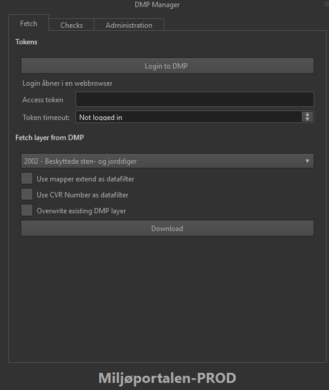
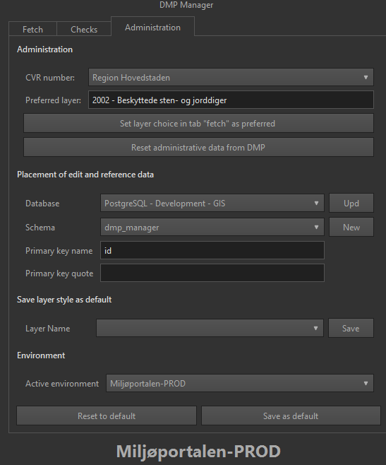
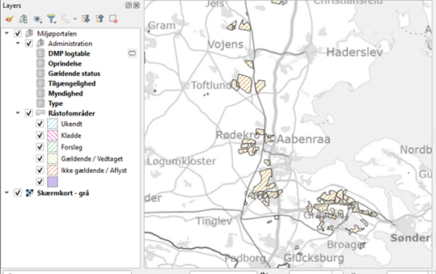
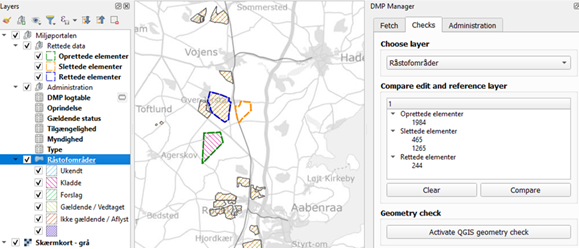
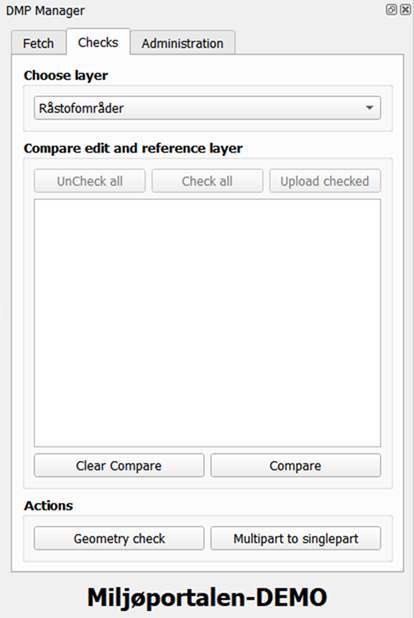
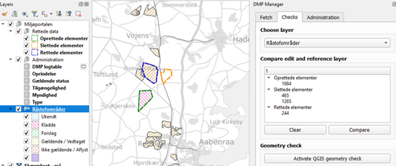
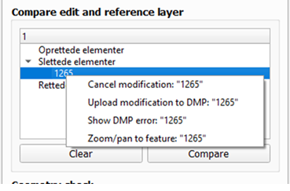
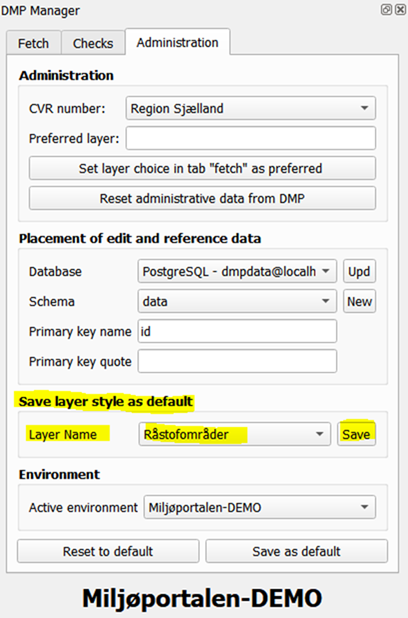

 
 

# Brugervejledning til QGIS DMP Manager - ET QGIS baseret plugin til håndtering og redigering af data fra Miljøportalen

## Indledning

QGIS DMP Manager er et plugin, som gør det muligt at downloade valgfri datalag fra DAI, Miljøportalen.

Data placeres i en lokal databasebaseret datakilde som tabeller. Modtagerdatabasen kan være PostgreSQL eller GeoPackage.

Ved Download oprettes der to tabeller for hvert datalag:

1. Et redigeringslag, hvor brugeren kan oprette, rette og slette poster.
2. Et referencelag, som er en kopi af data ved hentetidspunktet.

Redigeringslaget er et almindeligt data-lag i QGIS, så du kan bruge QGIS's redigeringsfunktioner direkte.

Du må ikke redigere i referencelaget, fordi plugin'et bruger det til senere sammenligning mellem redigeringslag og referencelag.

Du kan downloade flere datalag fra DAI i samme QGIS-projekt og redigere på tværs af lag.

Når redigering er færdig, kan plugin'et sammenligne redigeringslag og referencelag. Forskelle vises som lagene Oprettet, Rettet og Slettet i QGIS-kortvinduet. Derefter kan du kontrollere hvert element og skubbe (uploade) ændringer tilbage til DAI.

Plugin'et kan også gemme tematisering (symbolisering) for hver DAI-lagtype, så samme tematisering bruges ved senere downloads.

Plugin'et indeholder desuden administrative funktioner, fx opstart af QGIS geometri-tjekker.

Plugin'et kan bruges mod både demo-miljøet og produktionsmiljøet hos DAI, Miljøportalen.

NB! Vejledningen er skrevet til den engelske udgave af DMP Manager.
De danske oversættelser står i parentes () umiddelbart efter de engelske betegnelser.

## Installation

**Dette plugin fungerer kun på QGIS ver. 3.22 eller senere.**

Installation af plugin plus hjælpeprogram er beskrevet i en separat vejledning, som findes i samme GitHub repository: https://github.com/septima/DMP-MANAGER-DISTRIBUTION

## Opstart af plugin

DMP Manager startes via menupunkt Web -> DMP Manager -> DMP Manager.

Du kan også starte plugin'et via følgende ikon:

Herefter vises Brugerdialogen for DMP Manager - normalt placeret i højre side af QGIS's hovedskærmbillede:

## Initiel opsætning af DMP Manager

Før du kan bruge DMP Manager skal du foretage nogle få opsætninger i faneblad ”Administration”:

Gennemfør opsætningen punkt for punkt i afsnittene nedenfor.

* I afsnit Administration kan du sætte en række informationer.

    * I valgfeltet CVR number (CVR nummer) vælges CVR-nummeret for en bestemt virksomhed/institution ved at vælge firmaets/institutionens navn. Dette CVR-nummer kan bruges som filterværdi, så der kun downloades objekter fra DMP med det valgte CVR-nummer.
    NB! Nummeret tilføjes også automatisk til nyoprettede objekter lokalt i QGIS. Ved upload kan Miljøportalens datasystemer dog automatisk indsætte et evt. andet CVR-nummer ud fra brugerens login og tilhørsforhold. Dette gælder for størstedelen af datalagene.
    * Ved tryk på knap Set layer choice in tab Fetch as preferred (Sæt datatypevalg som foretrukkent) finder plugin'et den lagtype, som er valgt i faneblad Fetch (Hent data), og gør den til standard ved senere opstarter.
    * Ved tryk på knap Reset administrative data from DMP (Genindlæs administrative oplysninger fra DMP) genindlæser plugin'et administrative oplysninger fra Miljøportalen. Plugin'et installeres med et standardsæt af disse oplysninger, så funktionen er normalt ikke nødvendig. Hvis der opstår driftsfejl, kan en genindlæsning ofte afhjælpe problemet.

* Under afsnit Placement of edit and reference data (Placering af redigerings- og referencelag) skal du i drop-down boksen Database vælge, hvilken database DAI-data til redigering skal placeres i. Drop-down listen viser alle databaseforbindelser, der er opsat i QGIS under Open data source manager (CTRL-L) (Åbn Datakilde-håndtering (CTRL-L)). Hvis din database ikke findes i listen, skal du først oprette forbindelsen via denne QGIS-funktion.
Efter valg af database udfyldes drop-down boksen Schema automatisk med tilgængelige schemaer i den valgte database. Hvis databasetypen ikke bruger schema-begrebet, forbliver listen tom og inaktiv.
    * Hvis du ønsker at lave et nyt schema til dine data i databasen, kan du trykke på den smalle knap umiddelbart til højre for drop-down boksen Schema. Denne giver dig mulighed for at lave et nyt, tomt schema til dine data (hvis du har rettigheder til dette i den valgte database).
    * I tekst-felt Primary key name (Navn for primær nøgle) kan du indtaste navnet på det felt (kolonne) i redigerings- og referencelag, som vil indeholde den interne unikke nøgle (primary key) for QGIS. Navnet er forskelligt fra databasesystem til databasesystem, men vil normalt sættes til id for Postgres-databasekilder og fid for GeoPackage-datafiler.
    * I tekst-felt Primary key quote (Tekst adskiller) kan du indtaste karakteren for en tekstafgrænser for den valgte databasetype, hvis din primary key er af typen tekst. Tekstafgrænser er normalt en apostrof ('). Ellers skal du efterlade feltet tomt.
Det er yderst sjældent at feltet skal være andet end tomt.

* I afsnit Environment (Data miljø) kan du vælge, om du vil arbejde mod Miljøportalens demo-miljø eller produktionsmiljø.
Ved skift af data-miljø fra Demo til Produktion eller omvendt bliver du advaret om, at QGIS skal genstartes, før skiftet virker. Du kan desuden skulle vente op mod en time, hvis en allerede gennemført logon endnu ikke er udløbet.
    * Hvis du fortsætter, bliver data-miljøet skiftet permanent, og QGIS lukkes ned. Herefter benytter QGIS det valgte data-miljø.
(Note: Grunden til forsinkelsen på en time er, at det ikke har været muligt at få logoff til Miljøportalen til at fungere inde fra plugin'et. Derfor må man vente, til Miljøportalens automatiske logoff sker efter ca. en time.)

Når alle relevante parametre i fanebladet er værdisat, trykkes der på knap Save as default (Gem opsætninger). Dette gemmer alle valg og indtastninger som den nye opsætning.
Hvis man har lavet en række (evt. fejlagtige) valg eller indtastninger, kan man genindlæse de oprindelige oplysninger for plugin'et ved at trykke på knap Reset to default (Genindlæs opsætninger).
NB! Når man først har trykket på Save as default (Gem opsætninger) knappen kan man ikke genindlæse de oprindelige oplysninger.
 
## Dagligt arbejde med DMP Manager  

Det daglige arbejde med DMP Manager følger i store træk denne cyklus:
1.	Bruger indlæser et eller flere lag fra Miljøportalen. Disse lag indsættes automatisk som tabeller i databasen og tabellerne vises automatisk i QGIS’s kortvindue.

2.	Bruger redigerer de indlæste data med QGIS's indbyggede redigeringsværktøjer. Redigeringssessionen kan strække sig over flere dage og/eller nedlukninger af QGIS ved at gemme opsætningen som et QGIS-projekt og indlæse projektet ved genopstart.

3.	Når bruger er klar til at skubbe rettelser tilbage til Miljøportalen, benyttes DMP Managers værktøjer til at kontrollere/sammenligne redigerede og oprindelige data. Derefter kan ændringer skrives til Miljøportalen eller forkastes én efter én.

Workflow gentages med andre/nye områder/temaer.

Ovenstående workflow understøttes af 2 faneblade i DMP Manager:

### Faneblad Fetch (Hent data)

Faneblad Fetch (Hent data) benyttes til at downloade data fra Miljøportalen.

For at downloade data fra Miljøportalen skal man først foretage login til portalen. Det gøres ved at trykke på knap Login to DMP (Login til Miljøportalen).
QGIS har i mellemtiden modtaget de nødvendige oplysninger til kommunikation med Miljøportalen for at hente og opdatere data.
Resultatet kan aflæses ved, at tekstfelterne Access token (Adgangs nøgle) og Token timeout (Nøgle udløber) udfyldes med information fra Miljøportalen.
NB! Disse felter kan redigeres, men dette gøres kun i forbindelse med test af nye opsætninger (så lad være med det!).
NB! Det er ikke strengt nødvendigt at trykke på knap Login to DMP (Login til Miljøportalen). Hvis du begynder at hente data uden at være logget ind, detekterer DMP Manager situationen og starter automatisk en login-proces, før download af data gennemføres.
Samme forhold gør sig også gældende, hvis login bliver ugyldigt pga. tidsudløb.

Operationelt forløb:

1. Tryk Login to DMP (Login til Miljøportalen).
2. Kontroller at felterne Access token og Token timeout udfyldes.
3. Fortsæt med datahentning.

Hvis du springer trin 1 over, starter plugin'et normalt login automatisk ved første Download.

#### Hente data fra Miljøportalen

For at hente data fra Miljøportalen bruges afsnit Fetch layer from DMP (Hent lag fra Miljøportalen) i faneblad Fetch (Hent data).

Operationelt forløb:

1. Vælg lag i drop-down listen med kode-nr. og navn.
2. Sæt evt. flueben i Use map extent as data filter (Benyt kortvindue som datafilter), hvis du kun vil hente data i aktuelt kortudsnit.
3. Sæt evt. flueben i Overwrite existing DMP layer (Overskriv eksisterende DMP lag), hvis tidligere data i databasen skal overskrives.
4. Sæt evt. flueben i Use CVR number as filter (Brug CVR nummer som filter), hvis der skal filtreres på CVR Number (CVR nummer).
5. Tryk Download (Hent data).

NB! Hvis Overwrite existing DMP layer ikke er markeret, og tabellen allerede indeholder data, vises en fejlmeddelelse, og der hentes ikke nye data.

NB! Der hentes både lagdata og opslagsdata (som separate tabeller i QGIS-lagviser).

Processen kan gentages for flere data-lag i samme QGIS-projekt.

### Faneblad Checks (Data tjek)

Faneblad Checks (Data tjek) benyttes til kontrol af modificerede data samt upload af disse data til Miljøportalen.

For at udføre kontrol af redigerede data (forberedelse til upload) bruges følgende forløb:

1. Vælg lag i drop-down boksen under Choose layer (Vælg lag).
2. Gem rettelser ved at gå ud af redigeringsmodus i QGIS (blyanten skal være grået ud).
3. Tryk Compare (Sammenlign) i afsnit Compare edit and reference layer (Sammenlign redigerings- og referencelag).

Dette starter en proces i plugin'et, som finder nyindsatte, rettede og slettede elementer i det valgte redigeringslag. Oplysningerne vises 2 steder:

1.	I QGIS-kortvinduet som 3 nye lag: "Oprettede elementer", "Slettede elementer" og "Rettede elementer" i laggruppe "Miljøportalen" -> "rettede data".

2.	I faneblad Checks (Data tjek), afsnit Compare edit and reference layer (Sammenlign redigerings- og referencelag), udfyldes en 3-grenet liste med de samme data.

Ved udfoldning af listen kan man undersøge de enkelte modificerede data.
Ved højreklik på de enkelte elementer vises en under-menu, som giver dig mulighed for at foretage en række handlinger på elementet.

* Cancel modification (Tilbagefør rettelse): Det valgte element føres tilbage til sin oprindelige tilstand: Slettede elementer genindsættes, Rettede elementer føres tilbage til sine oprindelige værdier/geometri, og oprettede elementer fjernes.

* Upload modification (Skub rettelse til DMP): Modifikationen af det enkelte element skubbes tilbage til Miljøportalen. Hvis modifikationen godkendes, tilpasses både redigeringslag og reference-lag, så elementet får samme udseende/værdisætning som i Miljøportalen.
Hvis upload gennemføres uden fejl, bliver elementet i listen gjort inaktivt, så der ikke kan foretages flere handlinger på det.

* Show DMP error (Vis sidste DMP fejl): Viser sidste fejlmeddelelse fra Miljøportalen, hvis skrivning af elementet til Miljøportalen fejlede.

* Zoom/pan to feature (Zoom / panorér til element): Kortvinduet zoomes/flyttes, så det relevante element vises tydeligt.

Ved at bruge ovenstående funktioner på hvert enkelt modificeret element kan alle modificerede elementer skrives til Miljøportalen.

Kort arbejdsmåde i praksis:

1. Udfør Compare.
2. Gennemgå elementer i træet.
3. Brug Cancel modification eller Upload modification pr. element.
4. Brug evt. masseupload med Check All/Uncheck All/Upload Checked.

Der er tre inaktive knapper placeret umiddelbart over sammenligningstræet. Disse bliver aktive, når der gennemføres en sammenligning. Knapperne bruges til masseopdatering af ændrede data til Miljøportalen.
Ud for hvert objekt-id i sammenligningstræet er der et afkrydsningsfelt, som bestemmer, om objektet omfattes af en masseopdatering. Dette felt kan sættes manuelt.

Alternativt kan man afkrydse samtlige poster i sammenligningstræet ved at trykke på knap Check All (Sæt alle krydser). Alle satte krydser kan fjernes ved at trykke på knap Uncheck All (Fjern alle krydser).
Slutteligt kan selve masseupload af rettelser til Miljøportalen gennemføres ved at trykke på knap Upload Checked (Skub alle afkrydsede). Masseupload svarer til, at du for hvert afkrydset objekt højreklikker på objekt-id og vælger Upload modification (Skub rettelse til DMP).

Ved tryk på knap Clear (Nulstil) i afsnit Compare edit and reference layer (Sammenlign redigerings- og referencelag) fjernes kontrollag fra kortvinduet, og listevinduet nulstilles.

Afsnit Actions (Aktioner) indeholder 2 trykknapper, som igangsætter forskellige funktioner.
* Geometry check (Geometri tjek)
Opstarter QGIS's indbyggede geometritjekker på det valgte lag under Choose layer (Vælg lag).
* Multipart to singlepart (Multipart til singlepart)
Opstarter en funktion, som gennemløber selekterede objekter i det valgte lag under Choose layer (Vælg lag). Hvert undersøgt objekt, som består af flere delobjekter, konverteres til 2 eller flere objekter med samme attributværdi som originalen. Det første nye objekt har samme objekt-id og version-id som det originale objekt.

Der er to krav for at bruge denne funktion:
1.	Laget må ikke være i redigeringsmodus, dvs. med "blyanten" aktiveret.
2.	Der skal være etableret en selektion af objekter, der skal behandles. Selektionen kan laves via alle selektionsmetoder i QGIS.

## Automatisk tematisering af hentede lag fra Miljøportalen

Plugin'et har mulighed for automatisk at tematisere hentede lag. Dette gøres på følgende måde:
1.	Hent et lag fra Miljøportalen. Første gang du henter det, vil det optræde med en simpel farvelægning valgt vilkårligt af QGIS.

2.	Du tematiserer kort-laget vha. den indbyggede symbologi-funktion i QGIS. Du kan bruge alle faciliteter i denne, inkl. opsætning af felter med lookup-funktioner osv.

3.	Herefter går du ind i faneblad Administration (Administration), afsnit Save layer as default (Gem lag symbologi som standard), hvor du i Layer Name (Lag navn) vælger laget, du vil gemme symbologi for og slutteligt trykker på Save (Gem).

Herefter vil det valgte lag automatisk blive tematiseret, hver gang du downloader dette lag fra Miljøportalen.
