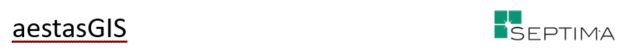
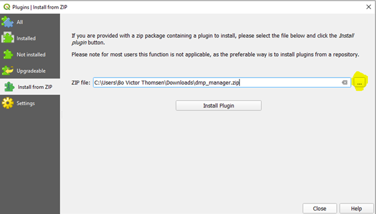

 
 

# Installationsvejledning til QGIS DMP Manager - Et QGIS baseret plugin til håndtering og redigering af data fra Miljøportalen

QGIS DMP Manager er et plugin, som gør det muligt at downloade valgfri datalag fra DAI, Miljøportalen.

Data placeres i en lokal databasebaseret datakilde som tabeller. Modtagerdatabasen kan være PostgreSQL eller GeoPackage.

Ved Download oprettes der to tabeller for hvert datalag:

1. Et redigeringslag, hvor brugeren kan oprette, rette og slette poster.
2. Et referencelag, som er en kopi af data ved hentetidspunktet.

Redigeringslaget er et almindeligt data-lag i QGIS, så du kan bruge QGIS's redigeringsfunktioner direkte.

Du må ikke redigere i referencelaget, fordi plugin'et bruger det til senere sammenligning mellem redigeringslag og referencelag.

Du kan downloade flere datalag fra DAI i samme QGIS-projekt og redigere på tværs af lag.

Når redigering er færdig, kan plugin'et sammenligne redigeringslag og referencelag. Forskelle vises som lagene Oprettet, Rettet og Slettet i QGIS-kortvinduet. Derefter kan du kontrollere hvert element og skubbe (uploade) ændringer tilbage til DAI.

Plugin'et kan også gemme tematisering (symbolisering) for hver DAI-lagtype, så samme tematisering bruges ved senere downloads.

Plugin'et indeholder desuden administrative funktioner, fx opstart af QGIS geometri-tjekker.

Plugin'et kan bruges mod både demo-miljøet og produktionsmiljøet hos DAI, Miljøportalen.

NB! Denne vejledning er skrevet til den engelske udgave af DMP Manager. Hvis du arbejder med den danske udgave af DMP Manager og bliver forvirret over sprogforskelle, kan du midlertidigt skifte QGIS til engelsk. Vejledningerne opdateres med danske oversættelser hurtigst muligt.

## Installation af DMP Manager plugin

**Dette plugin fungerer kun på QGIS ver. 3.22 eller senere.**

Du kan hente plugin-zip på to måder:

### Metode 1: Download kun plugin-zip

1. Gå til:
https://github.com/septima/DMP-MANAGER-DISTRIBUTION/blob/main/dmp_manager.zip
2. Tryk på knap Download.

### Metode 2: Download hele repository

1. Gå til:
https://github.com/septima/DMP-MANAGER-DISTRIBUTION
2. Tryk på grøn knap Code.
3. Vælg undermenuen Download ZIP.
4. Udpak den hentede zip-fil.
5. Find installationsfilen dmp_manager.zip.

## Installation i QGIS

Operationelt forløb:

1. Åbn menupunkt Plugins -> Manage and Install Plugins... -> faneblad Install from ZIP.
2. (Dansk UI: Plugins -> Administrer og Installer Plugins... -> faneblad Installer fra ZIP).
3. Vælg den gule mappeknap og find filen dmp_manager.zip (typisk i Overførsler, medmindre du har valgt en anden mappe).
4. Tryk Install Plugin.

Følgende brugerdialog vises:

Når installationen er gennemført, er plugin'et klar til brug.
